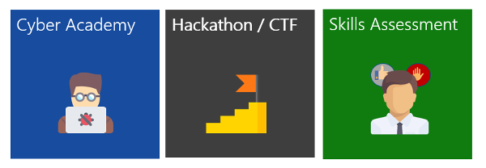
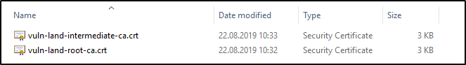

# Vulnerability Land CTF Domain
## Abstract
[Hacking-Lab](https://www.hacking-lab.com) is an online ethical hacking, computer network and security challenge and education platform. We deliver theory, practice-lab, exam and certification. 

## Hacking-Lab Services
We would be happy to support your cyber security initiative. We provide the following services. 

1. CTF (Capture-the-Flag) competitions
2. Cyber Academy (Learning, Practice, Exam)
3. Skill Assessment (HR recruitment process)

## Vuln.Land DNS Domain
vuln.land is our primarily DNS domain for the Hacking-Lab 2.0 vulnerable services and servers. 

## Vuln.Land Certification Authority

Most of our services use official and trusted SSL/TLS certificates. For some services, we use self-signed certificates. These certificates are signed by the following Hacking-Lab CA chain. 

1. [Intermediate Certification Authority](./cacerts/vuln-land-intermediate-ca.crt) 
2. [Root Certification Authority](./cacerts/vuln-land-root-ca.crt)

## Hacking-Lab LiveCD
You can use whatever client operating system you want when solving Hacking-Lab challenges, riddles and puzzles. 

But may you prefer a virtual machine for this? Use [Kali Linux](https://www.kali.org/) or alternatively our free [Kali-Linux based Hacking-Lab LiveCD](https://github.com/Hacking-Lab/hl-livecd) that comes with some extensions we like. (e.g docker, editors, and more ...)

The Hacking-Lab LiveCD is having some extensions installed - but in the core it is pure `Kali`!

